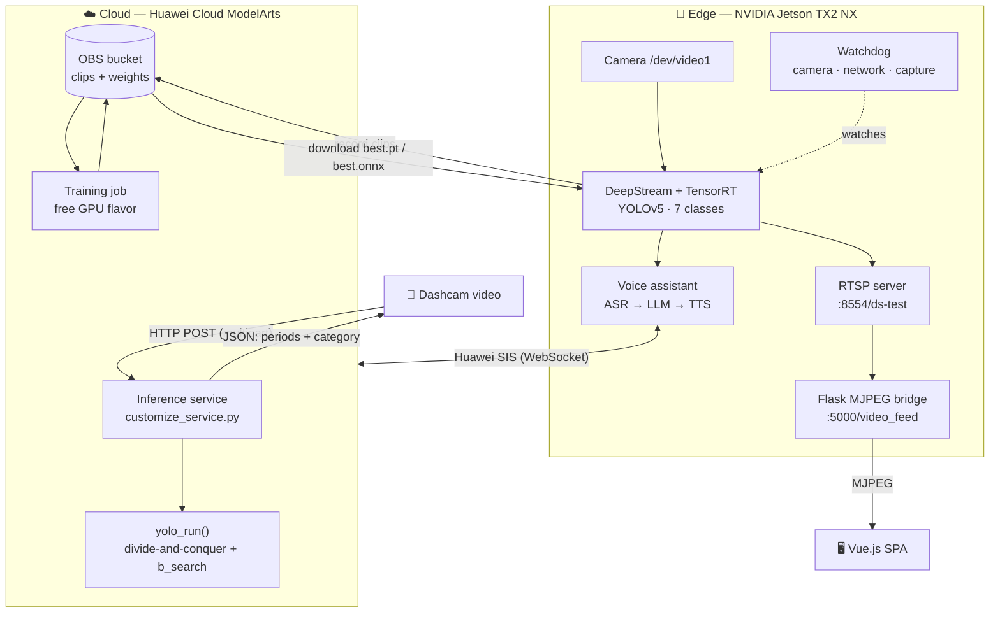
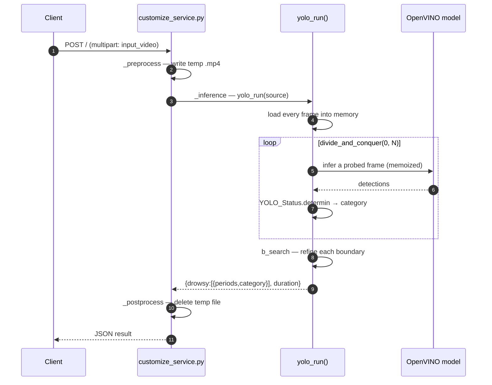
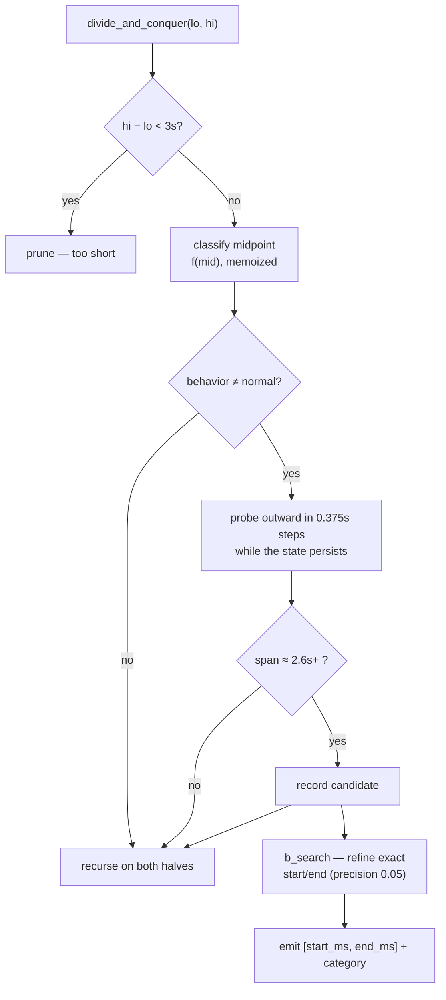
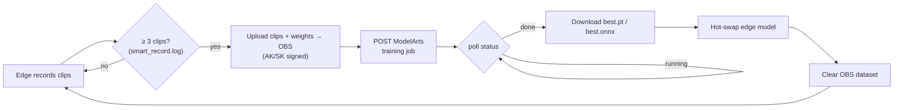

<p align="center">
  
</p>

<h1 align="center">Fatigue Driving Detection: Cloud-Edge Collaboration</h1>

<p align="center">
  <i><b>DriveVigil</b> — award-winning drowsy &amp; distracted-driving detection spanning
  Huawei Cloud ModelArts ☁️ and an NVIDIA Jetson TX2 NX 🚗</i>
</p>

<p align="center">
  <a href="LICENSE"></a>
  <a href="https://www.python.org/"></a>
  <a href="https://github.com/Nobody-Zhang/DriveVigil/actions/workflows/lint.yml"></a>
  
  
  
</p>

<p align="center">
  <b>English</b> · <a href="README_zh.md">中文版</a>
</p>

---

## Table of Contents

- [Overview](#overview)
- [System Architecture](#system-architecture)
- [How It Works](#how-it-works)
  - [Cloud inference lifecycle](#cloud-inference-lifecycle)
  - [Divide-and-conquer localization](#divide-and-conquer-localization)
  - [Cloud-edge OTA loop](#cloud-edge-ota-loop)
- [Features](#features)
- [Quick Start](#quick-start)
  - [Prerequisites](#prerequisites)
  - [Installation](#installation)
  - [Path A — Try the core algorithm (no hardware)](#path-a--try-the-core-algorithm-no-hardware)
  - [Path B — Deploy cloud inference (ModelArts)](#path-b--deploy-cloud-inference-modelarts)
  - [Path C — Run the edge stack (Jetson)](#path-c--run-the-edge-stack-jetson)
- [Configuration](#configuration)
- [Project Structure](#project-structure)
- [Development](#development)
- [Results](#results)
- [Citation](#citation)
- [License](#license)
- [Acknowledgments](#acknowledgments)

---

## Overview

**DriveVigil** detects fatigue and distracted-driving behaviors — eyes closed,
yawning, phone calls, and turning away — and is built as a **cloud-edge
collaboration**:

- **☁️ Cloud (Huawei Cloud ModelArts).** A serverless inference service scores an
  uploaded dashcam video and returns the exact time periods of each dangerous
  behavior. A custom **divide-and-conquer** temporal localizer finds those
  periods *without* running detection on every frame — this is the core IP and
  scored **0.9741** in the preliminary round.
- **🚗 Edge (NVIDIA Jetson TX2 NX).** A real-time DeepStream + TensorRT pipeline
  runs detection on a live camera, streams the annotated video to a web UI,
  raises spoken warnings, and keeps itself healthy with a watchdog. An **OTA
  loop** ships freshly recorded clips back to the cloud, retrains the model, and
  hot-swaps the new weights onto the device — all without stopping inference.

> Built for the Huawei Cloud track of the 18th "Challenge Cup" National College
> Students' Academic Science &amp; Technology Competition, where it won **Second
> Prize**. This is competition code shared as a reference implementation — expect
> leaderboard-tuned heuristics.

---

## System Architecture



| Plane | Runs on | Responsibility |
| ----- | ------- | -------------- |
| **Cloud** | ModelArts (Python 3.7, PyTorch 1.8 / CUDA 10.2) | Offline video scoring + model retraining |
| **Edge** | Jetson TX2 NX (DeepStream 6.0, CUDA 10.2) | Real-time detection, streaming, voice, self-healing |
| **Frontend** | Browser | Live view of the annotated stream + behavior alerts |

---

## How It Works

### Cloud inference lifecycle

Each cloud variant is a deployable ModelArts "custom AI application" defined by a
**two-file contract**: `config.json` (runtime + HTTP schema + pip deps) and
`customize_service.py` (a thin `PTServingBaseService`). All real work is delegated
to `yolo_run()`.



The response is authoritative in code:

```jsonc
{
  "result": {
    "drowsy": [
      { "periods": [start_ms, end_ms], "category": 1 }  // 0=normal 1=eyes-closed 2=yawn 3=calling 4=turning
    ],
    "duration": 6421                                      // inference time in ms
  }
}
```

The detector emits **7 YOLO classes in alphabetical index order** —
`close_eye=0, close_mouth=1, face=2, open_eye=3, open_mouth=4, phone=5,
sideface=6` — and `YOLO_Status.determin()` maps a single frame's boxes to one of
**5 behavior categories** via geometric heuristics (it selects the driver among
multiple faces, requires eyes/mouth to fall inside the face box, treats a phone
near the face as "calling", etc.).

### Divide-and-conquer localization

Rather than classifying all `N` frames, the localizer recursively bisects the
timeline and only probes where behavior is found, so cost scales with the number
of behavior *transitions*, not the video length.



- `f(frame_idx)` runs the model on one frame and is **memoized** — each frame is
  inferred at most once.
- `b_search()` binary-searches each candidate's boundary to a precision set by
  `iou_presice_b_search` (0.05 = accuracy-first).
- Weights load as **OpenVINO IR** (`best.xml` + `.bin`) through vendored
  YOLOv5's `DetectMultiBackend`. The pure classifier lives in
  [`cloud/preliminary/yolo/status.py`](cloud/preliminary/yolo/status.py) and is
  covered by the test suite.

### Cloud-edge OTA loop

The edge device closes the data loop: it collects real driving clips, retrains in
the cloud, and pulls the improved model back — continuously.



---

## Features

| Feature | Description |
| ------- | ----------- |
| 🎯 **YOLOv5 + OpenVINO detection** | 7-class detector (eyes, mouth, face, side-face, phone) deployed on ModelArts |
| ⏱️ **Divide-and-conquer localization** | Finds exact behavior periods without scanning every frame |
| ⚡ **Jetson + DeepStream** | Real-time edge inference via TensorRT with RTSP streaming |
| 🔁 **OTA model update** | Upload → cloud-retrain → hot-swap weights, without stopping inference |
| 🗣️ **Voice interaction** | Huawei SIS ASR → LLM (LLaMA / Qwen) → Huawei SIS TTS |
| 🩺 **Watchdog daemon** | C++ threads guard the camera, network, and capture loop |
| 🖥️ **Web dashboard** | Vue SPA shows the live annotated stream and alerts |

---

## Quick Start

### Prerequisites

The repo has three independent capabilities with very different requirements —
pick what you need:

| To run… | You need |
| ------- | -------- |
| **The test suite / core algorithm** | Python 3.8+ only (no GPU, cloud, or hardware) |
| **Cloud video scoring** | A Huawei Cloud account with ModelArts + OBS; downloaded model assets |
| **The edge real-time stack** | An NVIDIA Jetson TX2 NX (JetPack, DeepStream 6.0, CUDA 10.2) + a camera |
| **OTA / voice** | Huawei Cloud OBS + SIS, and optionally a DashScope (Qwen) API key |

> ⚠️ **Large binaries are not in git.** ~40 weights, TensorRT engines, OpenVINO IR,
> sample videos, and wheels live in [Releases v1.0](https://github.com/Nobody-Zhang/DriveVigil/releases/tag/v1.0)
> (see [docs/ASSETS.md](docs/ASSETS.md)). Cloud inference, the edge pipeline, and
> OTA do not run until `download_assets.sh` has fetched them.

### Installation

```bash
git clone https://github.com/Nobody-Zhang/DriveVigil.git
cd DriveVigil

# One-shot: create .venv, install requirements.txt, copy .env.example -> .env
bash scripts/setup_env.sh
source .venv/bin/activate

# Pull the large model/video assets from GitHub Releases v1.0
bash scripts/download_assets.sh

# Fill in your credentials (see Configuration below)
$EDITOR .env
```

### Path A — Try the core algorithm (no hardware)

The fastest way to see something working. The test suite exercises the per-frame
classifier and geometry helpers with **no GPU, cloud, or downloaded assets**:

```bash
python -m venv .venv && source .venv/bin/activate
pip install -r requirements-dev.txt
pytest                       # 14 tests, runs in well under a second
```

To run the **full localizer** on a bundled sample video (needs the runtime deps
and downloaded assets):

```bash
pip install -r requirements.txt
bash scripts/download_assets.sh
cd cloud/preliminary/yolo && python yolo_divide_and_conquer.py   # scores zipped.mp4
```

### Path B — Deploy cloud inference (ModelArts)

The canonical model is `cloud/preliminary/`. Deploy it as a ModelArts **custom AI
application** (the `config.json` + `customize_service.py` contract). Once a
real-time service is running, call it over HTTP:

```bash
# Token auth (set HUAWEICLOUD_TOKEN and HUAWEICLOUD_CLOUDINFER_URL in .env)
curl -X POST "$HUAWEICLOUD_CLOUDINFER_URL" \
     -H "X-Auth-Token: $HUAWEICLOUD_TOKEN" \
     -F "input_video=@sample.mp4"
```

```jsonc
// → response
{ "result": { "drowsy": [ { "periods": [3200, 6800], "category": 2 } ], "duration": 5910 } }
```

> Cloud code targets **Python 3.7** (`pytorch_1.8.0-cuda_10.2-py_3.7`). `cloud/semifinal/`
> is the same algorithm with relaxed thresholds; `cloud/baseline/` is an older
> dlib EAR/MAR approach.

### Path C — Run the edge stack (Jetson)

On a Jetson TX2 NX with DeepStream 6.0 installed:

```bash
# 1. Build the custom CUDA YOLO TensorRT output parser
CUDA_VER=10.2 make -C edge/deepstream/nvdsinfer_custom_impl_Yolo

# 2. Build & run the DeepStream app: camera -> TensorRT -> RTSP (:8554/ds-test)
cd edge/deepstream
CUDA_VER=10.2 make
./deepstream-app-test5-customized -c deepstream_app_config.txt

# 3. Bridge RTSP -> MJPEG for the browser, then open http://localhost:5000/video_feed
python app.py
```

Optional companion services:

```bash
# Watchdog daemon (needs OpenCV) — restarts/halts on camera or network failure
cd edge/watchdog && mkdir -p build && cd build && cmake .. && make && ./WatchDog

# OTA retraining loop (needs .env credentials)
cd edge/ota && python main.py

# Voice assistant: ASR -> LLM -> TTS
cd edge/voice/scripts && python recognize_generate4.py
```

---

## Configuration

All secrets are read from a local `.env` (template: [`.env.example`](.env.example));
`.env` is gitignored. **Never commit credentials** — see [SECURITY.md](SECURITY.md).

| Variable | Purpose |
| -------- | ------- |
| `HUAWEICLOUD_AK` / `HUAWEICLOUD_SK` | IAM access key / secret — sign OBS + ModelArts requests |
| `HUAWEICLOUD_TOKEN` | IAM token for token-authenticated inference calls |
| `HUAWEICLOUD_PROJECT_ID` | ModelArts project id |
| `HUAWEICLOUD_IMA_ID` | ModelArts algorithm/image id used by the OTA training job |
| `HUAWEICLOUD_REGION` | Region, e.g. `cn-north-4` |
| `HUAWEICLOUD_CLOUDINFER_URL` | Deployed inference service endpoint |
| `HUAWEICLOUD_MTCNN_URL` | MTCNN face-detection service endpoint |
| `DASHSCOPE_API_KEY` | Qwen / 通义千问 key for the voice assistant's LLM fallback |

---

## Project Structure

```
DriveVigil/
├── cloud/                       # Huawei Cloud ModelArts inference apps
│   ├── baseline/                # PyTorch + dlib EAR/MAR baseline
│   ├── preliminary/             # ★ best score 0.9741 — divide-and-conquer
│   │   └── yolo/
│   │       ├── status.py        # pure per-frame classifier (unit-tested)
│   │       └── yolo_divide_and_conquer.py
│   └── semifinal/               # 0.8807 — same algorithm, relaxed thresholds
├── edge/                        # NVIDIA Jetson TX2 NX
│   ├── deepstream/              # DeepStream/TensorRT pipeline (see COMPETITION.md)
│   ├── ota/                     # cloud-edge OTA retraining loop
│   ├── cloud_finetune/          # vendored YOLOv5 training code
│   ├── voice/                   # voice assistant (ASR + LLM + TTS)
│   ├── watchdog/                # C++ monitoring daemon
│   ├── mtcnn/                   # MTCNN face detection + Euler angles
│   ├── apigw/                   # Huawei API Gateway SDK wrapper
│   └── frontend/                # prebuilt Vue.js SPA
├── tests/                       # pytest suite for the core classifier
├── scripts/                     # setup_env.sh, download_assets.sh
├── configs/ · utils/ · docs/
```

---

## Development

Tooling targets **Python 3.8** (cloud code deploys to ModelArts on Python 3.7).
Work inside a virtual environment:

```bash
python -m venv .venv && source .venv/bin/activate
pip install -r requirements-dev.txt
```

Lint, format, and test — all gated in CI:

```bash
ruff check .            # lint    (ruff check --fix .  to auto-fix)
ruff format --check .   # format  (ruff format .       to apply)
pytest                  # unit tests for the core classifier + geometry helpers
```

See [CONTRIBUTING.md](CONTRIBUTING.md) for the full guide — vendored-tree
boundaries, the Python 3.7/3.8 split, and the near-duplicate cloud variants.

---

## Results

| Stage | Score | Key Approach |
| ----- | ----- | ------------ |
| Preliminary | **0.9741** | YOLOv5 + OpenVINO + divide-and-conquer (confidence 0.4) |
| Semi-final | 0.8807 | Same algorithm, relaxed thresholds |
| **Final** | 🏆 **Second Prize** | Full cloud-edge system demo |

---

## Citation

```bibtex
@misc{zhang2023fatigue,
    title   = {Fatigue Driving Detection: Cloud-Edge Collaboration},
    author  = {Gongbo Zhang and Shuming Guo and Luran Lv and Aolin Zhang and
               Xingyu Chen and Jintian Wu and Yufan Jia and Zheyu Zhou and
               Jiahao Zhang and Jinshen Zhang},
    year    = {2023},
    url     = {https://github.com/Nobody-Zhang/DriveVigil}
}
```

## License

This project is released under the [Apache 2.0 License](LICENSE).

## Acknowledgments

- **Team**: The Big Radish of the Production Team, HUST
- **Directors**: Jian Zhou, Fei Wu
- **Special Thanks**: Minhan Tang, Yongye Lai, Haoyu Deng, Shiyu Zhang
- Built with [Huawei Cloud ModelArts](https://www.huaweicloud.com/product/modelarts.html), [NVIDIA DeepStream](https://developer.nvidia.com/deepstream-sdk), and [YOLOv5](https://github.com/ultralytics/yolov5)

---

Congratulations to Yongye Lai, Xuejia Chen et al. for winning the **Grand Prize** in the [19th Challenge Cup - Huawei Track](https://github.com/HUSTMiracle/BLBDGCD_huawei2024)!
