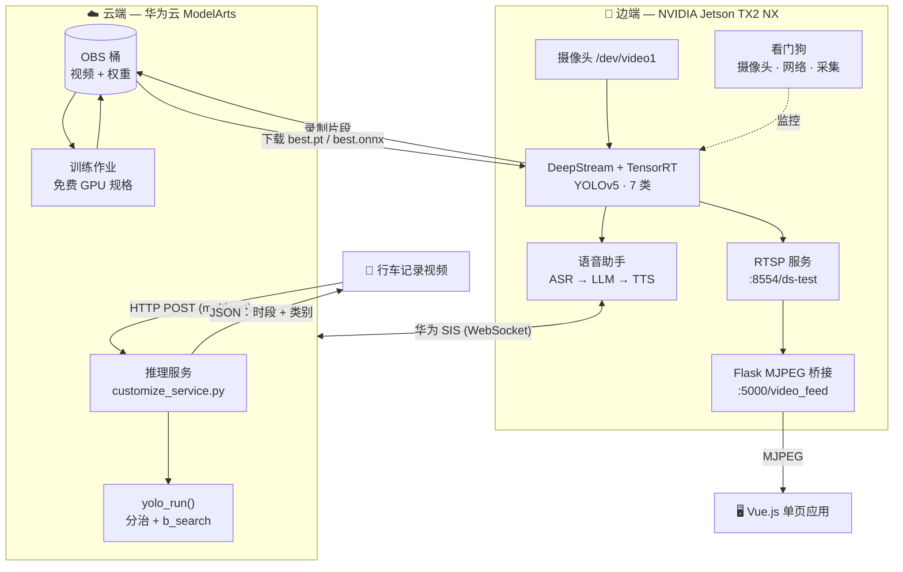
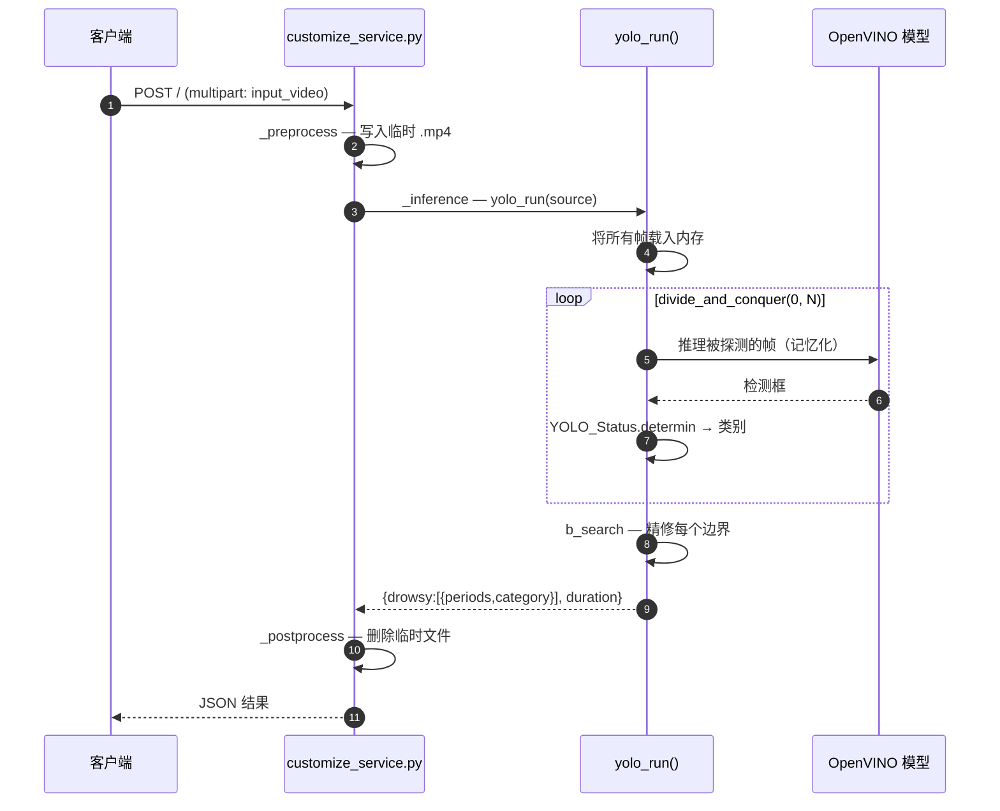
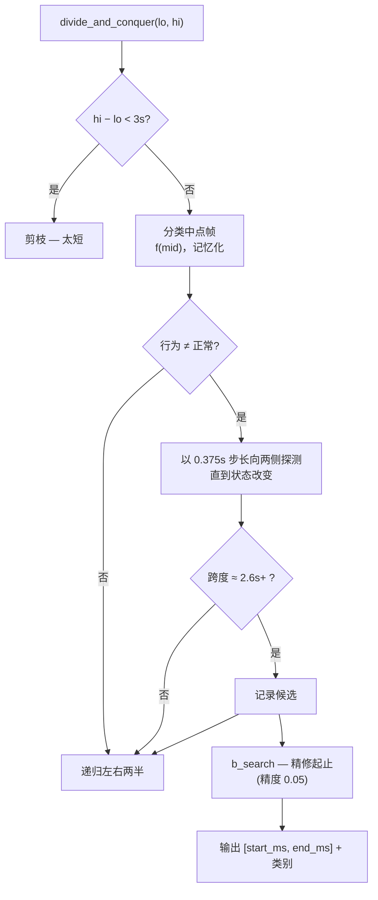
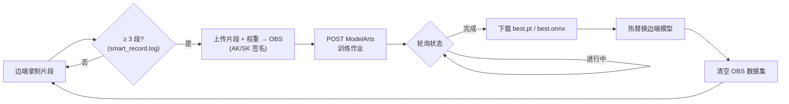

<p align="center">
  
</p>

<h1 align="center">疲劳驾驶检测：云边协同系统</h1>

<p align="center">
  <i><b>DriveVigil</b> — 获奖的疲劳与分心驾驶检测系统，横跨
  华为云 ModelArts ☁️ 与 NVIDIA Jetson TX2 NX 🚗</i>
</p>

<p align="center">
  <a href="LICENSE"></a>
  <a href="https://www.python.org/"></a>
  <a href="https://github.com/Nobody-Zhang/DriveVigil/actions/workflows/lint.yml"></a>
  
  
  
</p>

<p align="center">
  <a href="README.md">English</a> · <b>中文</b>
</p>

---

## 目录

- [概览](#概览)
- [系统架构](#系统架构)
- [工作原理](#工作原理)
- [功能特性](#功能特性)
- [快速开始](#快速开始)
- [环境变量配置](#环境变量配置)
- [项目结构](#项目结构)
- [开发](#开发)
- [比赛成绩](#比赛成绩)
- [引用](#引用)
- [许可证](#许可证)
- [致谢](#致谢)

---

## 概览

**DriveVigil** 检测疲劳与分心驾驶行为——闭眼、打哈欠、打电话、转头——并采用**云边协同**架构：

- **☁️ 云端（华为云 ModelArts）。** 一个无服务器推理服务对上传的行车记录视频进行评分，
  返回每种危险行为的精确时间区间。核心 IP 是一套**分治（divide-and-conquer）**时间定位算法，
  无需逐帧检测即可定位这些区间——它在初赛中取得 **0.9741** 的成绩。
- **🚗 边端（NVIDIA Jetson TX2 NX）。** 一条实时 DeepStream + TensorRT 流水线在真实摄像头上运行检测，
  将标注后的视频推送到 Web 界面、发出语音预警，并由看门狗保障自身健康。一个 **OTA 闭环**
  把新录制的片段回传云端、重训模型，并把新权重热替换到设备上——全程不中断推理。

> 本项目为第 18 届"挑战杯"全国大学生课外学术科技作品竞赛 "揭榜挂帅"专项赛 华为云赛道参赛作品，
> 荣获 **二等奖**。作为参考实现开源——其中包含为打榜调优的启发式策略。

---

## 系统架构



| 层 | 运行于 | 职责 |
| -- | ----- | ---- |
| **云端** | ModelArts（Python 3.7，PyTorch 1.8 / CUDA 10.2） | 离线视频评分 + 模型重训 |
| **边端** | Jetson TX2 NX（DeepStream 6.0，CUDA 10.2） | 实时检测、推流、语音、自愈 |
| **前端** | 浏览器 | 实时查看标注视频流与行为预警 |

---

## 工作原理

### 云端推理流程

每个云端变体都是一个可部署的 ModelArts "自定义 AI 应用"，由**双文件契约**定义：
`config.json`（运行时 + HTTP 接口 + pip 依赖）与 `customize_service.py`（一个轻量
`PTServingBaseService`）。所有实际工作都委托给 `yolo_run()`。



返回结构以代码为准：

```jsonc
{
  "result": {
    "drowsy": [
      { "periods": [start_ms, end_ms], "category": 1 }  // 0=正常 1=闭眼 2=哈欠 3=打电话 4=转头
    ],
    "duration": 6421                                      // 推理耗时（毫秒）
  }
}
```

检测器输出**按字母序排列的 7 个 YOLO 类别**——`close_eye=0, close_mouth=1, face=2,
open_eye=3, open_mouth=4, phone=5, sideface=6`——`YOLO_Status.determin()` 通过几何启发式
将单帧的检测框映射到 **5 种行为类别**（从多张人脸中选出司机、要求眼睛/嘴在脸框内、
手机贴近脸即判为"打电话"等）。

### 分治时间定位

算法不逐帧分类全部 `N` 帧，而是递归二分时间轴、只在发现行为处探测，因此开销取决于行为
*跳变*的次数，而非视频长度。



- `f(frame_idx)` 对单帧运行模型并**记忆化**——每帧至多推理一次。
- `b_search()` 以 `iou_presice_b_search`（0.05，准确率优先）的精度二分定位每个候选的边界。
- 权重以 **OpenVINO IR**（`best.xml` + `.bin`）经 vendored YOLOv5 的 `DetectMultiBackend` 加载。
  纯分类器位于 [`cloud/preliminary/yolo/status.py`](cloud/preliminary/yolo/status.py)，并有测试覆盖。

### 云边 OTA 闭环

边端设备闭合数据回路：采集真实驾驶片段、在云端重训、再把改进后的模型拉回——持续循环。



---

## 功能特性

| 特性 | 说明 |
| ---- | ---- |
| 🎯 **YOLOv5 + OpenVINO 检测** | 部署在 ModelArts 上的 7 类检测器（眼、嘴、正脸、侧脸、手机） |
| ⏱️ **分治时间定位** | 无需逐帧扫描即可定位精确行为区间 |
| ⚡ **Jetson + DeepStream** | 基于 TensorRT 的实时边缘推理，支持 RTSP 推流 |
| 🔁 **OTA 模型更新** | 上传 → 云端重训 → 热替换权重，推理不中断 |
| 🗣️ **语音交互** | 华为 SIS 语音识别 → LLM（LLaMA / 通义千问）→ 华为 SIS 语音合成 |
| 🩺 **看门狗守护进程** | C++ 多线程守护摄像头、网络与采集循环 |
| 🖥️ **Web 看板** | Vue 单页应用展示实时标注视频流与预警 |

---

## 快速开始

### 前置条件

本仓库有三种相互独立、要求差异很大的能力——按需选择：

| 想运行… | 你需要 |
| ------- | ----- |
| **测试套件 / 核心算法** | 仅需 Python 3.8+（无需 GPU、云或硬件） |
| **云端视频评分** | 开通 ModelArts + OBS 的华为云账号；已下载模型资源 |
| **边缘实时系统** | 一台 NVIDIA Jetson TX2 NX（JetPack、DeepStream 6.0、CUDA 10.2）+ 摄像头 |
| **OTA / 语音** | 华为云 OBS + SIS，语音 LLM 兜底可选配 DashScope（通义千问）密钥 |

> ⚠️ **大文件不在 git 中。** 约 40 个权重、TensorRT 引擎、OpenVINO IR、示例视频与 wheel 包
> 托管在 [Releases v1.0](https://github.com/Nobody-Zhang/DriveVigil/releases/tag/v1.0)
> （见 [docs/ASSETS.md](docs/ASSETS.md)）。在 `download_assets.sh` 拉取它们之前，
> 云端推理、边缘流水线与 OTA 都无法运行。

### 安装

```bash
git clone https://github.com/Nobody-Zhang/DriveVigil.git
cd DriveVigil

# 一键：创建 .venv、安装 requirements.txt、复制 .env.example -> .env
bash scripts/setup_env.sh
source .venv/bin/activate

# 从 GitHub Releases v1.0 拉取大文件资源
bash scripts/download_assets.sh

# 填写凭证（见下方"环境变量配置"）
$EDITOR .env
```

### 路径 A：试跑核心算法（无需硬件）

最快看到效果的方式。测试套件覆盖逐帧分类器与几何辅助函数，**无需 GPU、云或任何下载资源**：

```bash
python -m venv .venv && source .venv/bin/activate
pip install -r requirements-dev.txt
pytest                       # 14 个测试，远不到一秒
```

在内置示例视频上运行**完整定位器**（需要运行时依赖与已下载资源）：

```bash
pip install -r requirements.txt
bash scripts/download_assets.sh
cd cloud/preliminary/yolo && python yolo_divide_and_conquer.py   # 对 zipped.mp4 评分
```

### 路径 B：部署云端推理（ModelArts）

规范模型是 `cloud/preliminary/`。将其作为 ModelArts **自定义 AI 应用**部署
（`config.json` + `customize_service.py` 契约）。在线服务运行后，通过 HTTP 调用：

```bash
# Token 鉴权（在 .env 中设置 HUAWEICLOUD_TOKEN 与 HUAWEICLOUD_CLOUDINFER_URL）
curl -X POST "$HUAWEICLOUD_CLOUDINFER_URL" \
     -H "X-Auth-Token: $HUAWEICLOUD_TOKEN" \
     -F "input_video=@sample.mp4"
```

```jsonc
// → 响应
{ "result": { "drowsy": [ { "periods": [3200, 6800], "category": 2 } ], "duration": 5910 } }
```

> 云端代码以 **Python 3.7** 为目标（`pytorch_1.8.0-cuda_10.2-py_3.7`）。`cloud/semifinal/`
> 是相同算法但放宽了阈值；`cloud/baseline/` 是更早的 dlib EAR/MAR 方案。

### 路径 C：运行边缘端（Jetson）

在已安装 DeepStream 6.0 的 Jetson TX2 NX 上：

```bash
# 1. 编译自定义 CUDA YOLO TensorRT 输出解析器
CUDA_VER=10.2 make -C edge/deepstream/nvdsinfer_custom_impl_Yolo

# 2. 编译并运行 DeepStream 应用：摄像头 -> TensorRT -> RTSP (:8554/ds-test)
cd edge/deepstream
CUDA_VER=10.2 make
./deepstream-app-test5-customized -c deepstream_app_config.txt

# 3. 把 RTSP 桥接成 MJPEG 供浏览器查看，然后打开 http://localhost:5000/video_feed
python app.py
```

可选配套服务：

```bash
# 看门狗守护进程（需 OpenCV）——摄像头或网络故障时重启/停止
cd edge/watchdog && mkdir -p build && cd build && cmake .. && make && ./WatchDog

# OTA 重训闭环（需要 .env 凭证）
cd edge/ota && python main.py

# 语音助手：ASR -> LLM -> TTS
cd edge/voice/scripts && python recognize_generate4.py
```

---

## 环境变量配置

所有密钥从本地 `.env` 读取（模板：[`.env.example`](.env.example)），`.env` 已被 gitignore。
**切勿提交凭证**——见 [SECURITY.md](SECURITY.md)。

| 变量 | 用途 |
| ---- | ---- |
| `HUAWEICLOUD_AK` / `HUAWEICLOUD_SK` | IAM 访问密钥 / 私钥——为 OBS 与 ModelArts 请求签名 |
| `HUAWEICLOUD_TOKEN` | 用于 token 鉴权推理调用的 IAM Token |
| `HUAWEICLOUD_PROJECT_ID` | ModelArts 项目 ID |
| `HUAWEICLOUD_IMA_ID` | OTA 训练作业使用的 ModelArts 算法/镜像 ID |
| `HUAWEICLOUD_REGION` | 区域，如 `cn-north-4` |
| `HUAWEICLOUD_CLOUDINFER_URL` | 已部署的推理服务端点 |
| `HUAWEICLOUD_MTCNN_URL` | MTCNN 人脸检测服务端点 |
| `DASHSCOPE_API_KEY` | 语音助手 LLM 兜底使用的通义千问密钥 |

---

## 项目结构

```
DriveVigil/
├── cloud/                       # 华为云 ModelArts 推理应用
│   ├── baseline/                # PyTorch + dlib EAR/MAR 基线
│   ├── preliminary/             # ★ 最优成绩 0.9741 — 分治算法
│   │   └── yolo/
│   │       ├── status.py        # 纯逐帧分类器（已被测试覆盖）
│   │       └── yolo_divide_and_conquer.py
│   └── semifinal/               # 0.8807 — 相同算法，放宽阈值
├── edge/                        # NVIDIA Jetson TX2 NX
│   ├── deepstream/              # DeepStream/TensorRT 流水线（见 COMPETITION.md）
│   ├── ota/                     # 云边 OTA 重训闭环
│   ├── cloud_finetune/          # vendored YOLOv5 训练代码
│   ├── voice/                   # 语音助手（ASR + LLM + TTS）
│   ├── watchdog/                # C++ 监控守护进程
│   ├── mtcnn/                   # MTCNN 人脸检测 + 欧拉角
│   ├── apigw/                   # 华为 API 网关 SDK 封装
│   └── frontend/                # 预构建 Vue.js 单页应用
├── tests/                       # 核心分类器的 pytest 套件
├── scripts/                     # setup_env.sh、download_assets.sh
├── configs/ · utils/ · docs/
```

---

## 开发

工具链以 **Python 3.8** 为目标（云端代码部署在 ModelArts 的 Python 3.7 上）。请在虚拟环境中开发：

```bash
python -m venv .venv && source .venv/bin/activate
pip install -r requirements-dev.txt
```

代码检查、格式化与测试（均为 CI 门禁）：

```bash
ruff check .            # 检查    （ruff check --fix .  自动修复）
ruff format --check .   # 格式化  （ruff format .       应用格式化）
pytest                  # 核心分类器与几何辅助函数的单元测试
```

完整指南（vendored 目录边界、Python 3.7/3.8 差异、近重复的云端变体）见 [CONTRIBUTING.md](CONTRIBUTING.md)。

---

## 比赛成绩

| 阶段 | 得分 | 关键方案 |
| ---- | ---- | ------- |
| 初赛 | **0.9741** | YOLOv5 + OpenVINO + 分治算法（置信度 0.4） |
| 复赛 | 0.8807 | 相同算法，放宽阈值 |
| **决赛** | 🏆 **二等奖** | 完整云边协同系统演示 |

---

## 引用

```bibtex
@misc{zhang2023fatigue,
    title   = {Fatigue Driving Detection: Cloud-Edge Collaboration},
    author  = {Gongbo Zhang and Shuming Guo and Luran Lv and Aolin Zhang and
               Xingyu Chen and Jintian Wu and Yufan Jia and Zheyu Zhou and
               Jiahao Zhang and Jinshen Zhang},
    year    = {2023},
    url     = {https://github.com/Nobody-Zhang/DriveVigil}
}
```

## 许可证

本项目基于 [Apache 2.0 许可证](LICENSE) 开源。

## 致谢

- **团队**：生产队的大萝卜，华中科技大学
- **指导老师**：周建、吴菲
- **特别感谢**：唐岷瀚、赖永烨、邓皓宇、张诗语
- 基于 [华为云 ModelArts](https://www.huaweicloud.com/product/modelarts.html)、[NVIDIA DeepStream](https://developer.nvidia.com/deepstream-sdk) 和 [YOLOv5](https://github.com/ultralytics/yolov5) 构建

---

恭喜赖永烨、陈薛嘉等同学在 [第19届挑战杯华为云赛道](https://github.com/HUSTMiracle/BLBDGCD_huawei2024) 中荣获**特等奖**！
